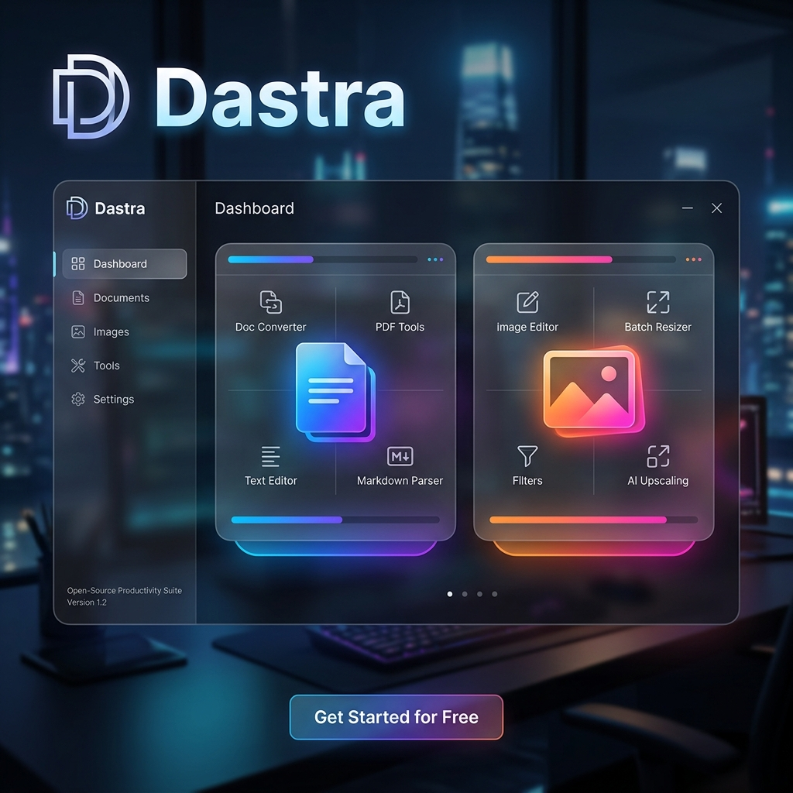
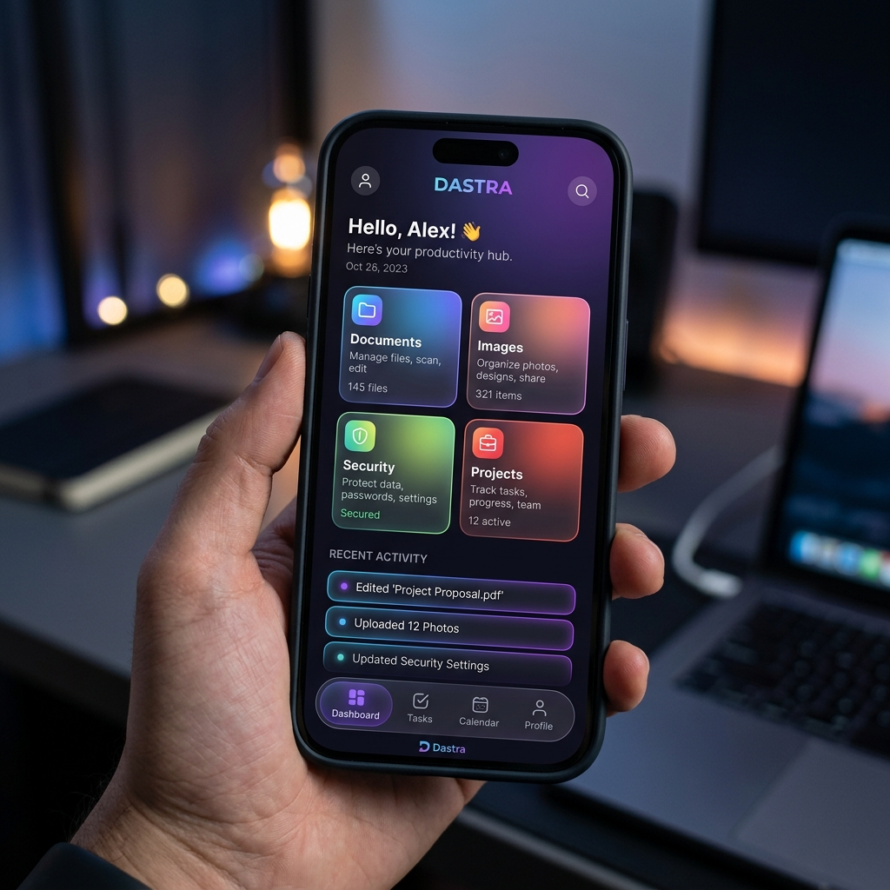

<p align="center">
  
</p>

<h1 align="center">Dastra</h1>

<p align="center">
  <strong>Your Ultimate Offline Productivity Suite</strong>
</p>

<p align="center">
  <a href="#features">Features</a> •
  <a href="#installation">Installation</a> •
  <a href="#architecture">Architecture</a> •
  <a href="#building-from-source">Building</a> •
  <a href="#roadmap">Roadmap</a>
</p>

<p align="center">
  
  
  
  
</p>

---

## ⚡ Introduction

In a world increasingly reliant on cloud services, **Dastra** guarantees that your sensitive documents, images, and credentials never leave your machine. Dastra is a privacy-first, 100% offline productivity suite built with Flutter and Native runtimes. 

With a beautiful, adaptive Material 3 UI, Dastra feels perfectly at home whether you are on a multi-monitor desktop setup or on the go with your Android device.

## ✨ Key Features

| Category | Features |
| :--- | :--- |
| **📄 Documents** | Convert PDFs to Word (`.docx`), Merge PDFs, Split pages, Compress PDF file size. |
| **🖼 Images** | Compress image file sizes drastically without noticeable quality loss. |
| **🔐 Security** | Generate highly secure passwords offline, evaluate cryptographic strength. |
| **🗃 Workspace** | Track your productivity with an integrated, searchable SQLite conversion history. |

## 📸 Screenshots

<table>
  <tr>
    <td align="center"><b>Desktop Dashboard</b></td>
    <td align="center"><b>Android Experience</b></td>
  </tr>
  <tr>
    <td></td>
    <td></td>
  </tr>
</table>

## 🏗 Architecture Overview

Dastra employs a strict **Screen → Controller → Service → Storage** architectural pattern, heavily relying on Provider for state management. 

For heavy lifting, Dastra uses an adaptive execution engine:
- **Windows**: Bundles native Python executables (via PyInstaller) for complex document transformations.
- **Android**: Falls back to Pure Dart processing libraries to ensure maximum compatibility within the mobile sandbox.

Read more in our [Architecture Guide](docs/architecture.md).

## 🚀 Installation

### Windows Portable (Zero Install)
1. Download `Dastra-v1.0.0-rc.1-Windows-Portable.zip` from the [Releases](https://github.com/yourrepo/dastra/releases) page.
2. Extract to a writable directory (e.g., your Desktop or a USB drive).
3. Double-click `dastra.exe`.

### Android
1. Download `Dastra-v1.0.0-rc.1-Android.apk`.
2. Tap the APK to install on your mobile device.

*See the full [Installation Guide](release/installation-guide.md) for more details.*

## 💻 Building from Source

Ensure you have the Flutter SDK (v3.x) installed.

```bash
# Clone the repository
git clone https://github.com/yourusername/dastra.git
cd dastra

# Install dependencies
flutter pub get

# Build Windows Executable
flutter build windows

# Build Android APK
flutter build apk
```

For more advanced instructions (like rebuilding the bundled Python engines), see the [Build Guide](docs/build-guide.md).

## 🛡 Privacy First Philosophy

Dastra contains **Zero Telemetry**. We do not track your usage, we do not require you to create an account, and we do not connect to the cloud. Your files remain exclusively on your local device.

## 🗺 Roadmap

- **v1.0 RC1**: Current - Material 3 Adaptive UI, Offline Docs, Images, Security, SQLite Workspace.
- **v1.1**: Plugin API, Video Processing (FFmpeg), Audio Extraction.
- **v2.0**: Local AI capabilities (Small Language Models), Universal macOS distribution.

See the full [Roadmap](ROADMAP.md).

## 🤝 Contributing

We welcome contributions! Please see our [Contributing Guidelines](CONTRIBUTING.md) and [Code of Conduct](CODE_OF_CONDUCT.md).

## 📜 License

**Pending License Selection**. 
*(This project is currently evaluating open-source licenses for the final v1.0 release. Please contact the maintainer for usage rights until the license is officially selected.)*

---
<p align="center">Made with ❤️ by Pratik Das and the Open Source Community.</p>
