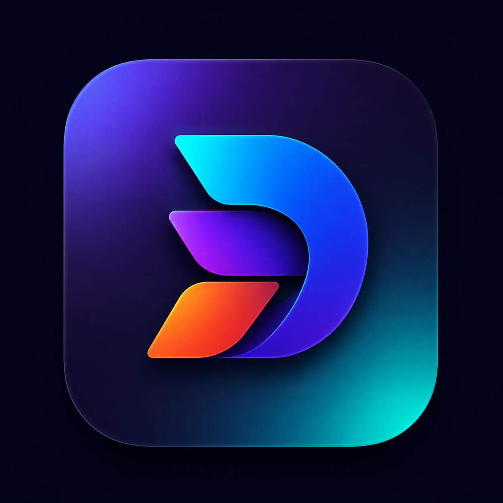

<h1 align="center">
   
  Dastra
</h1>

  <strong>Universal Offline Document & Media Engineering Suite</strong>

  
  
  
  
  

---

## 🚀 Overview
Dastra is a powerful, beautifully designed productivity suite that operates **100% offline**. It consolidates multiple document manipulation, image processing, and security tools into a single desktop and mobile application. Built with Flutter, it ensures maximum speed and absolute privacy—zero telemetry, zero cloud uploads.

**Dastra v1.0.0** introduces our new dual-edition architecture:
- **Community Edition**: The public, stable release available to everyone.
- **Developer Edition**: An internal build used for testing experimental modules.

## ✨ Features
- **📄 Document Engineering**: Merge PDFs, Split PDFs, compress documents, and convert PDFs to Images.
- **🖼️ Image Utilities**: Compress images locally and perform offline format conversions without losing quality.
- **🔒 Security Tools**: Generate unbreakable passwords, check password entropy, and verify local security offline.
- **⚡ Offline-First Architecture**: Powered by SQLite for workspace history and natively embedded C++ engines (PDFium).
- **🌟 Dastra Pro (Coming Soon)**: A glimpse into our future premium tier, unlocking PDF-to-Word, OCR, and Batch Processing.

## 💾 Installation

### Windows (x64)
1. Navigate to the **[Releases](https://github.com/PratikDas-VTU/Dastra/releases)** page.
2. Download `DastraSetup.exe`.
3. Run the installer and follow the wizard. It will securely install Dastra to your system and configure your local data securely in `%LOCALAPPDATA%`.
*Note: A Portable version (`DastraPortable.zip`) is also available if you prefer not to install it system-wide.*

### Android
1. Navigate to the **[Releases](https://github.com/PratikDas-VTU/Dastra/releases)** page.
2. Download `Dastra.apk` directly to your Android device.
3. Tap the APK to install (you may need to allow installations from unknown sources).

## 🗺️ Roadmap
- **v1.0.0 (Stable)**: Production-ready installer, dual-edition architecture, and stable release!
- **v1.1.0**: Unlocking Dastra Pro subscription models and advanced PDF-to-Word features.
- **v1.2.0**: Native macOS and Linux support.
- **v2.0.0**: Local AI integration for intelligent document summarization.

## 🤝 Contributing
Dastra bug reports, feature requests, and documentation improvements are highly welcome! Please see our [Contributing Guide](CONTRIBUTING.md) for details. For instructions on how to build the Developer Edition installers from source, see [Installer Build Guide](docs/INSTALLER_BUILD.md).

## 🛡️ Security & Privacy
We take privacy seriously. Dastra is fundamentally offline. If you discover any security vulnerabilities, please refer to our [Security Policy](SECURITY.md).

## ⚖️ License
Dastra is proudly open-source and licensed under the [Apache 2.0 License](LICENSE).

---

<i>Designed for Privacy and Speed. Developed by Pratik Das.</i>

