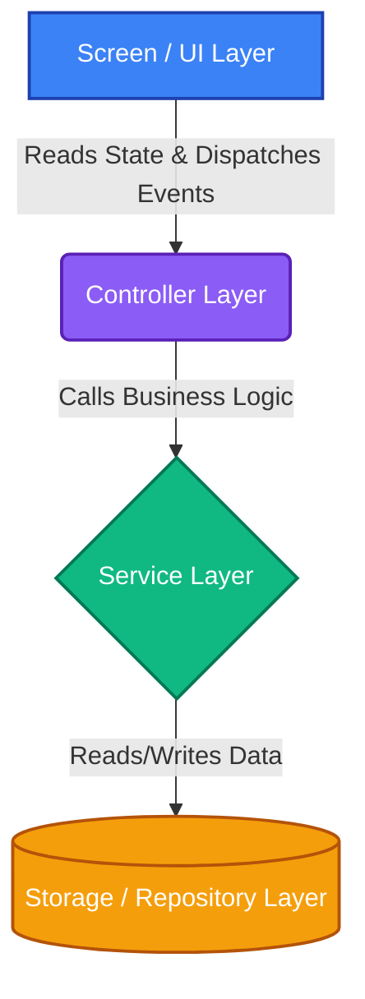
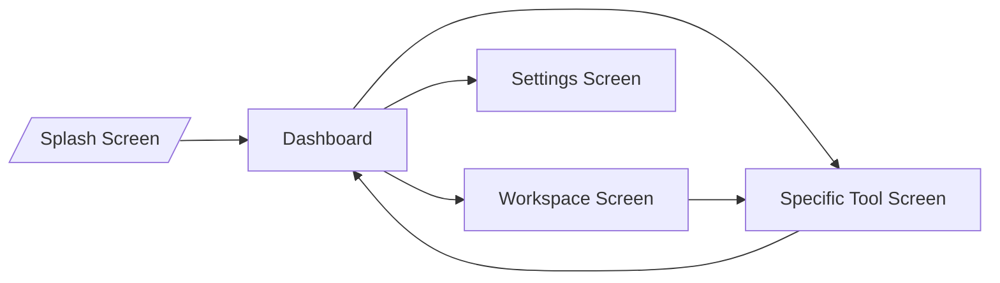

# Dastra Architecture

Dastra follows a strict **Screen → Controller → Service → Storage** architectural pattern. This ensures a clean separation of concerns, highly testable code, and scalable logic across different form factors (Desktop vs. Mobile).

## Core Architecture Flow

### 1. Screen (UI Layer)
Located in `presentation/`. This layer strictly renders UI components and is entirely stateless. It watches the controller (via `Provider`) and reacts to state changes.

### 2. Controller (State Layer)
Located in `presentation/controller/` or `controller/`. Controllers extend `ChangeNotifier`. They hold the view state, handle user input, and coordinate with the service layer. Controllers contain **no hardcoded business logic**.

### 3. Service Layer (Business Logic)
Located in `domain/` or `services/`. Services perform the actual logic (e.g., executing a PDF conversion, communicating with Python scripts via the Desktop Runtime).

### 4. Storage / Repository Layer
Located in `domain/` or `data/`. Interfaces with SQLite, SharedPreferences, or the local file system.

## Screen Navigation Flow

Dastra uses `go_router` for deep linking and predictable navigation.

## Module Architecture

Every feature in Dastra is modularized inside the `lib/modules/` directory:

- `dashboard/`: The entry point and tool catalog.
- `workspace/`: The productivity center (history and recent files).
- `settings/`: Application preferences, theming, and about page.
- `document/`: PDF and Document processing tools.
- `image/`: Image processing tools.
- `security/`: Password generators and security tools.

This modular structure allows new tool categories to be dropped into the codebase without affecting existing architecture.
