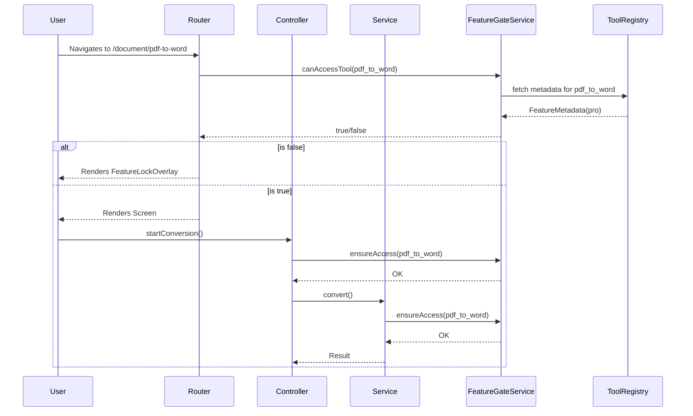

# Premium Architecture

Dastra implements a highly robust 5-layer authorization model designed to ensure that premium features cannot be accessed without proper authorization, even if a user bypasses the UI layer.

## The 5-Layer Authorization Flow

The security model assumes that any outer layer can be bypassed (e.g. via deep linking, direct route injection, or UI modifications). Thus, every subsequent layer must independently verify authorization.

1. **Layer 1: UI (Presentation)**
   - **Component**: `AdaptiveToolCard`, `DastraSearchSection`
   - **Behavior**: Clicking a locked feature immediately displays the `UpgradeDialog` without initiating any navigation.
   - **Purpose**: Provides a smooth, non-disruptive user experience.

2. **Layer 2: Router (Navigation)**
   - **Component**: `GatedToolScreen` wrapping routes in `GoRouter`.
   - **Behavior**: If navigation is triggered (via deep link, history, or quick action), the route itself is wrapped. Unauthorized access renders a full-screen `FeatureLockOverlay`.
   - **Purpose**: Prevents direct URL/route manipulation from bypassing the gate.

3. **Layer 3: Controller (State Management)**
   - **Component**: Tool Controllers (e.g., `PdfToWordController`)
   - **Behavior**: Injects `FeatureGateService` and explicitly calls `ensureAccess(ToolIds.pdfToWord)` before starting processing state.
   - **Purpose**: Ensures that even if the UI renders unexpectedly, state logic cannot be triggered. Throws `UnauthorizedException` if denied.

4. **Layer 4: Service (Business Logic)**
   - **Component**: Tool Services (e.g., `PdfToWordService`)
   - **Behavior**: Injects `FeatureGateService` and explicitly calls `ensureAccess(toolId)` before engaging underlying engines.
   - **Purpose**: Prevents controller bypassing.

5. **Layer 5: Runtime & Identity (Source of Truth)**
   - **Component**: `FeatureGateService`, `ToolRegistry`, `SubscriptionService`
   - **Behavior**: The only layer aware of `BuildProfile` and `FeatureMetadata`. It cross-references the requested `toolId` against the `ToolRegistry` to determine access rights based on dynamic rules (Subscription tier, Platform availability, etc.).

## Data Flow Diagram

## Audit Logging
Every authorization request evaluated by `FeatureGateService` is logged locally with a timestamp, `toolId`, `granted` status, `activeProfile`, and `tier` for debugging. This log is exclusively offline.
