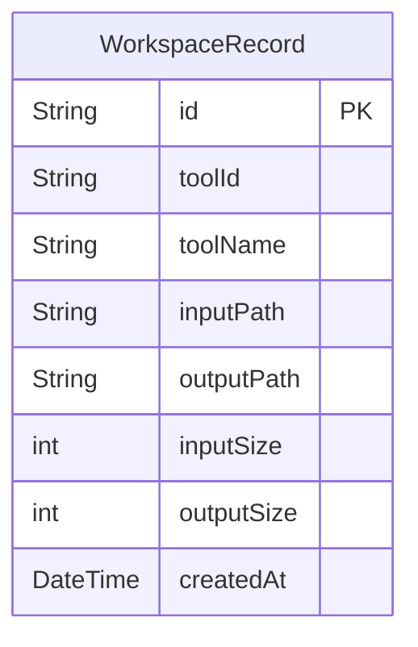

# Local Storage Architecture

Dastra guarantees privacy by keeping all data on the local device. The application does not contain HTTP clients for telemetry or data exfiltration.

## Workspace Database

The Workspace relies on a local SQLite database to track conversion history.

- **Implementation**: Uses `sqflite` (Mobile) and `sqflite_common_ffi` (Desktop).
- **Location**: 
  - Installed Desktop: `AppData/Roaming/Dastra/`
  - Portable Desktop: `./data/`
  - Mobile: App-specific internal storage.

## User Preferences

User settings (theme, favorite tools, default paths) are stored using `SharedPreferences`.

- The `UserPreferencesController` acts as a facade over `SharedPreferences`.
- Theme changes are applied instantaneously across the app using `Provider`.
