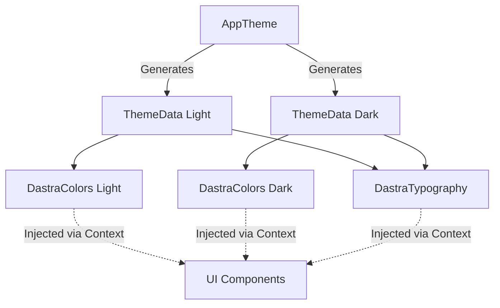

# Theming

Dastra supports Dynamic Light and Dark modes. The theming system is implemented using Flutter's `ThemeExtension`, ensuring strong type safety and centralized color definitions.

## Theme Architecture

## How to Add New Colors

1. Open `lib/core/theme/dastra_colors.dart`.
2. Add the new color property to the `DastraColors` class.
3. Update the `lerp` method (required for smooth theme transitions).
4. Update `AppTheme.lightColors` and `AppTheme.darkColors` in `app_theme.dart`.

## Best Practices

- Always test your UI in both Light and Dark mode.
- Avoid low-contrast text. Use `textPrimary`, `textSecondary`, and `textTertiary` appropriately.
- For gradients, use the predefined gradients (e.g., `splashGradient`, `documentGradient`) defined in `DastraColors`.
