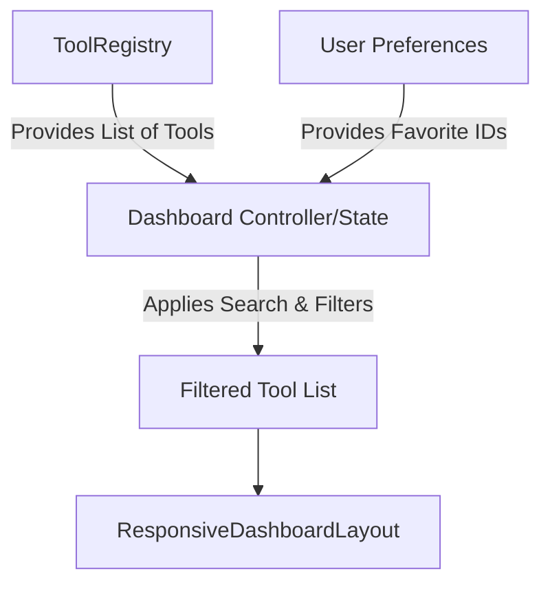

# Dashboard Architecture

The Dashboard is the entry point of Dastra. It functions as a dynamic catalog of all registered tools.

## Architecture

The Dashboard is completely stateless regarding tool availability. It pulls everything directly from the `ToolRegistry`.

## Responsive Layouts
- **Searching State**: When the user is searching or filtering, the Dashboard renders a flat grid of results (`_SearchResultsSection`).
- **Browsing State**: When no search is active, the Dashboard groups tools by category (Documents, Images, Security) into visually distinct horizontal slivers.

## Favoriting System
Users can "star" a tool from the Dashboard. This interaction communicates with the `UserPreferencesController` to append the Tool ID to the `favoriteToolIds` list in `SharedPreferences`. The Dashboard reactively re-renders to place the tool in the Favorites section.
