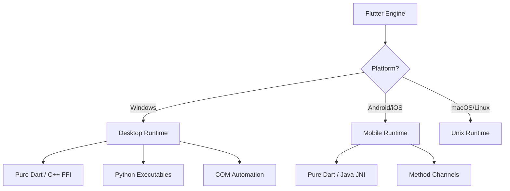

# Runtime Capabilities Flow

Dastra utilizes different runtimes depending on the target platform. Because Dastra is 100% offline, it relies entirely on local compute.

## Cross-Platform Runtime Architecture

## How It Works
When a tool executes (e.g., PDF to Word), the Controller checks `Platform.isWindows`. If true, it invokes the Desktop Engine (which uses Python `pdf2docx`). If on Android, it might use a native Method Channel or fall back to a Dart implementation.

This ensures maximum performance on desktops while maintaining compatibility on mobile devices.
