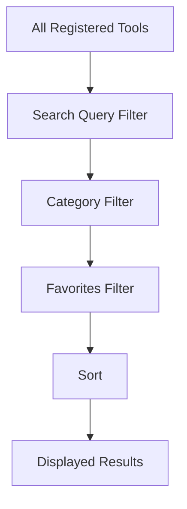

# Tool Registry

The `ToolRegistry` (`lib/core/utils/tool_registry.dart`) is the centralized catalog of all tools available in Dastra. It acts as the single source of truth for the Dashboard, Workspace, and Search systems.

## Tool Item Model

Every tool must be registered as a `ToolItem`:

```dart
class ToolItem {
  final String id;          // Unique identifier (e.g., 'pdf_to_word')
  final String title;       // Display name
  final String description; // Short description
  final IconData icon;      // Material Icon
  final ToolCategory category; // Enum category (document, image, security)
  final List<Color> gradientColors; // Theming gradient
  final String route;       // go_router path
  final List<TargetPlatform>? supportedPlatforms; // Optional platform restrictions
  final List<String>? requiredRuntimes; // E.g., 'python', 'libreoffice'
}
```

## Adding a New Tool

1. Define your tool's UI and Controller in the appropriate module folder (e.g., `lib/modules/document/new_tool/`).
2. Add a `GoRoute` in `lib/core/router/app_router.dart`.
3. Add the `ToolItem` to the corresponding static list in `ToolRegistry` (e.g., `documentTools`).
4. The Dashboard and Workspace will automatically dynamically populate the new tool.

## Tool Filtering Pipeline


