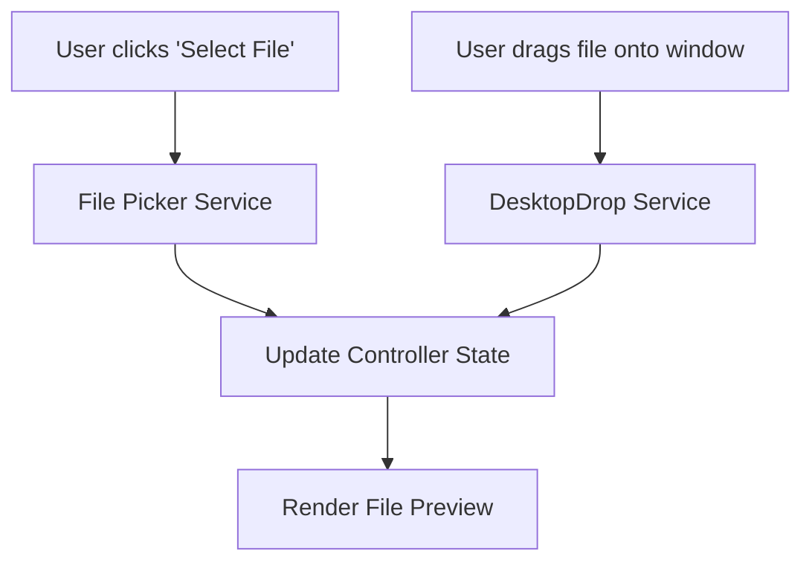

# Tool UI Guidelines

Consistency is critical for Dastra's user experience. When building the UI for a new tool, strictly adhere to these guidelines.

## 1. Top-Level Layout

All tools must be wrapped in an `AdaptiveScaffold`:

```dart
return AdaptiveScaffold(
  title: 'My Tool',
  body: DastraPage(
    maxWidth: 1200, // Tools generally use 1200 max width
    child: ...,
  )
);
```

## 2. Desktop vs. Mobile Layouts

Tools should adapt their layout based on screen width using `Adaptive.of(context)` or `ResponsiveBuilder`.

- **Mobile (< 840px)**: Stack the Configuration Card and the File Dropzone vertically.
- **Desktop (>= 840px)**: Use a `Row` with flexible expansion. Typically, the Configuration Options take up `Flex: 1` (or fixed width ~400px), and the Dropzone/Preview takes up `Flex: 2`.

## 3. Configuration Cards

Tool options (sliders, text fields, radio buttons) must be enclosed within a `DastraCard` (or `DastraContentSection`).

- Use consistent padding (`AppSpacing.xl` for Desktop, `AppSpacing.lg` for Mobile).
- Use `context.typography.h4` for section headers.
- Separate distinct options with `Divider(color: context.colors.border)`.

## 4. The Action Button

The primary action button (e.g., "Convert", "Merge", "Generate") should always be prominently displayed at the bottom of the configuration card or the screen. 
Use a `DastraButton` with `isFullWidth: true`.

## 5. File Selection & Dropzones

Always support both explicit file picking (button click) and drag-and-drop (using `DastraDropzone`).


