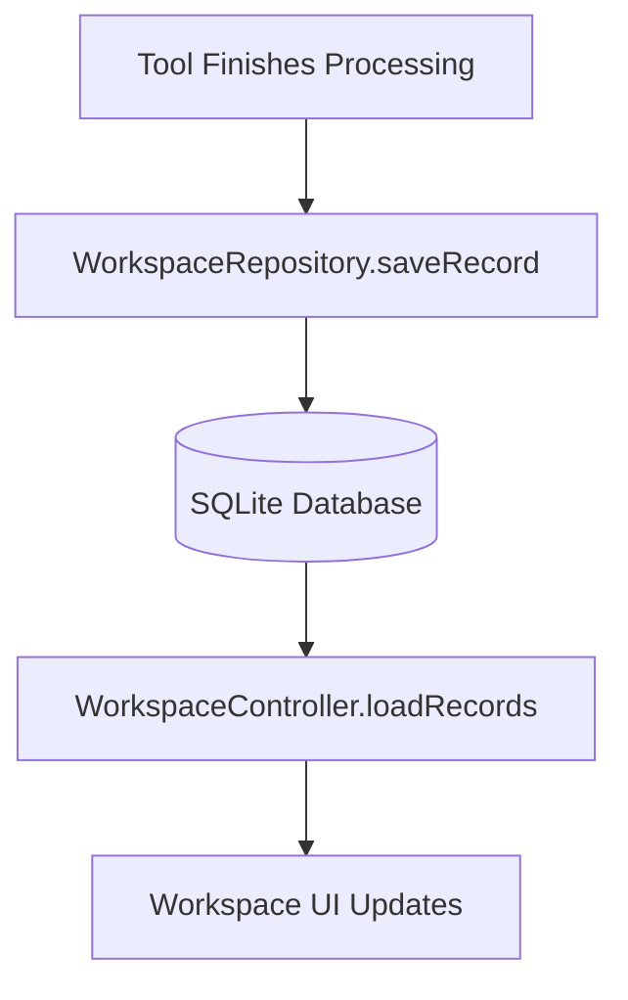

# Workspace Architecture

The Workspace is the user's operational center in Dastra. It serves as a unified history and file management view for every operation performed within the app.

## Data Flow

## UI Hierarchy
The Workspace UI (`lib/modules/workspace/presentation/workspace_screen.dart`) is divided into distinct sections prioritizing productivity:
1. **Header & Statistics**: Brief summary of the day's tasks.
2. **Quick Actions**: Rapidly jump to common tasks (Resume Last, Open Folder).
3. **Recent Conversions**: The core list of recent files.
4. **Filter Bar**: An integrated `DastraSearchSection` to filter records by tool category or search query.

## Empty States
The Workspace dynamically renders contextual Empty States (`WorkspaceEmptyState`) depending on whether there are genuinely no records, or if a filter query yielded zero results.
